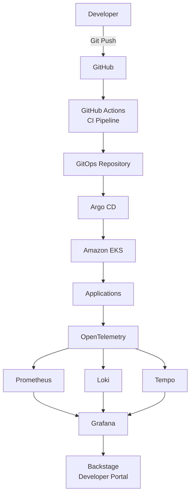

# Platform Blueprint

A production-ready reference platform demonstrating modern Platform Engineering practices on AWS using Kubernetes, GitOps, and OpenTelemetry.

## Overview

Platform Blueprint is an opinionated reference implementation of an Internal Developer Platform (IDP).

The goal is to demonstrate how engineering organizations can build a scalable, secure, observable, and self-service platform that improves developer productivity while reducing operational complexity.

This repository is inspired by production patterns used across modern cloud-native organizations.

---

## Objectives

- Build production-ready infrastructure with Terraform
- Provision Amazon EKS following AWS best practices
- Adopt GitOps with Argo CD
- Enable end-to-end observability using OpenTelemetry
- Standardize deployments through reusable platform patterns
- Improve developer experience with self-service workflows
- Document architectural decisions and operational runbooks

---

## Technology Stack

| Layer | Technology |
|--------|------------|
| Cloud | AWS |
| IaC | Terraform |
| Container Orchestration | Amazon EKS |
| GitOps | Argo CD |
| CI | GitHub Actions |
| Metrics | Prometheus |
| Logging | Loki |
| Tracing | Tempo |
| Telemetry | OpenTelemetry |
| Visualization | Grafana |
| Developer Portal | Backstage *(planned)* |

---

## Architecture

## High-Level Architecture


                        
---

## Repository Structure

```text
docs/
architecture/
terraform/
kubernetes/
gitops/
observability/
applications/
scripts/
```

---

## Project Status

🚧 Work in Progress

Current Milestone:
- Repository Foundation

Upcoming Milestones

- AWS Infrastructure
- Amazon EKS
- GitOps
- OpenTelemetry
- Observability
- Internal Developer Platform
- SLOs & Runbooks

---

## Roadmap

See `/docs/ROADMAP.md`

---

## License

MIT
