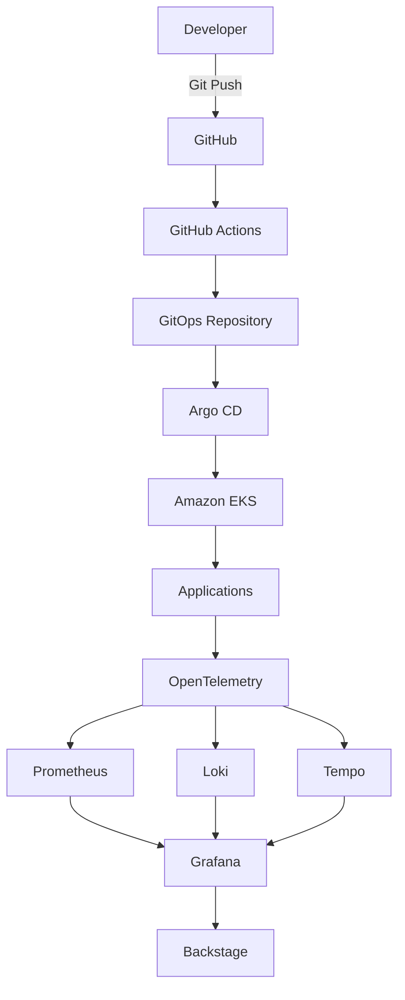

# Platform Architecture

## Overview

Platform Blueprint is a production-ready reference architecture for building modern Internal Developer Platforms (IDPs) on AWS.

The architecture is designed around four primary goals:

- Improve developer experience
- Standardize application delivery
- Enable end-to-end observability
- Build secure and reliable cloud-native platforms

Rather than focusing on individual tools, the platform focuses on reducing operational complexity through automation and standardized workflows.

---

# Architecture Principles

The platform is built around the following engineering principles.

## Developer Experience First

Developers should spend time building software—not managing infrastructure.

The platform provides standardized deployment workflows, observability, and self-service capabilities.

---

## Everything as Code

Infrastructure, Kubernetes resources, and platform configuration are version-controlled.

Examples include:

- Infrastructure as Code (Terraform)
- GitOps (Argo CD)
- Kubernetes manifests
- CI workflows

---

## GitOps by Default

Git is the single source of truth.

Every infrastructure and application change is reviewed, versioned, and automatically synchronized into Kubernetes.

---

## Observability Built In

Every workload should automatically expose:

- Metrics
- Logs
- Traces

without requiring application teams to build custom integrations.

---

## Secure by Default

Security is part of the platform rather than an afterthought.

Examples include:

- IAM Roles for Service Accounts (IRSA)
- Network Policies
- Secrets Management
- TLS Everywhere

---

# High-Level Architecture

---

# Platform Components

| Component | Purpose |
|-----------|---------|
| Terraform | Infrastructure provisioning |
| Amazon EKS | Kubernetes platform |
| GitHub Actions | Continuous Integration |
| Argo CD | GitOps deployment |
| OpenTelemetry | Telemetry collection |
| Prometheus | Metrics |
| Loki | Logs |
| Tempo | Distributed tracing |
| Grafana | Unified observability |
| Backstage | Internal Developer Portal |

---

# Platform Workflow

1. Developer pushes code to GitHub.
2. GitHub Actions builds, tests, and publishes the container image.
3. GitHub Actions updates the GitOps repository.
4. Argo CD detects the change.
5. Argo CD synchronizes Kubernetes.
6. Applications emit metrics, logs, and traces using OpenTelemetry.
7. Grafana provides a unified observability experience.
8. Backstage provides developers with a centralized platform experience.

---

# Future Architecture

The platform will evolve to include:

- Multi-environment deployments
- Multi-cluster GitOps
- External Secrets
- cert-manager
- Karpenter
- Cluster Autoscaler comparison
- Service Mesh
- SLO management
- Cost optimization
- Incident response automation
- AI-assisted operations

---

# Design Goals

The architecture is designed to demonstrate production-grade Platform Engineering practices rather than serving as a simple Kubernetes deployment example.

Key objectives include:

- Scalability
- Reliability
- Security
- Observability
- Automation
- Developer self-service
